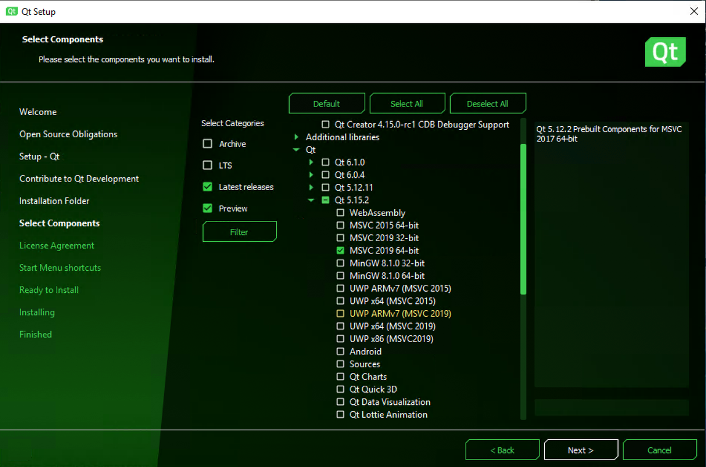
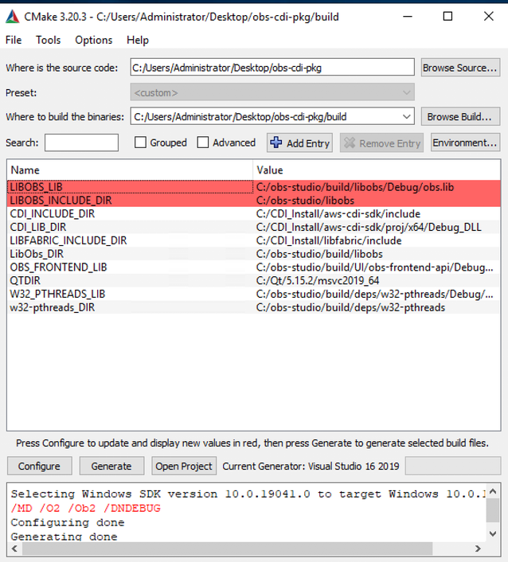

Build Instructions for AWS CDI Plugin for OBS
=============================================

These are the build instructions for the OBS CDI plugin.  The broad steps are to build CDI, build OBS, then build the OBS CDI plugin.  You must build OBS from source in order to have a development environment with all the needed headers. 
 This plugin will enable a single CDI output of the OBS program output.  The plugin requires the pixel format to be I444 and converts I444 to YCbCr 10-bit 4:2:2.  The plugin also expects stereo audio at 48khz. We have tested this plugin with various frame rates and raster sizes but find that 1080p60 performs the best. There is a known issue where OBS sometimes crashes when turning off the CDI output and a second known issue where sometimes OBS CDI senses the wrong pixel format from the OBS configuration.  The solution to both is simply to exit and restart the application. 
 **NOTE**: These steps have only been verified to work for Debug/Debug DLL builds

Launch an EC2 instance w/ EFA such as c5n.18xl or g4dn.metal 

-   Using Windows Server 2019 base AMI
-   Use public IP
-   Use 100GB for EBS volume due to size of QT install

Download and build AWS CDI and dependencies

Follow the instructions at [https://github.com/aws/aws-cdi-sdk/blob/mainline/INSTALL\_GUIDE\_WINDOWS.md](https://github.com/aws/aws-cdi-sdk/blob/mainline/INSTALL_GUIDE_WINDOWS.md) with the following amendments:

Add a step: After the step to “Install Microsoft Visual Studio 2019 with Chocolatey from Powershell, do: 

-   choco install visualstudio2019-workload-nativedesktop -y 

When the steps direct you to the Linux installation guide at “Clone (or download) the libfabric repo as described in [linux installation guide](https://github.com/aws/aws-cdi-sdk/blob/mainline/INSTALL_GUIDE_LINUX.md#install-aws-cdi-sdk)”, only follow that specific section “Install AWS CDI SDK” - do not continue past this section. 

Before the section labeled “Build the AWS CDI SDK”, disable the CloudWatch metrics in configuration.h by commenting out lines 245 and 262 which should be the CLOUDWATCH\_METRICS\_ENABLED and METRICS\_GATHER\_SERVICE\_ENABLED. After commenting out, those lines should look like:

-   //\#define CLOUDWATCH\_METRICS\_ENABLED
-   //\#define METRICS\_GATHERING\_SERVICE\_ENABLED

In Visual Studio, build CDI as Debug\_DLL build type by selecting Debug\_DLL from the dropdown prior to Build → Build Solution

Download and build OBS Studio and dependencies:

Follow the instructions at [https://obsproject.com/wiki/install-instructions\#windows-build-directions](https://obsproject.com/wiki/install-instructions#windows-build-directions) with the following amendments:

For QT5, the link to the online installer is here: [https://www.qt.io/cs/c/?cta\_guid=074ddad0-fdef-4e53-8aa8-5e8a876d6ab4&signature=AAH58kGC69gc8nJ6\_hRdK6bzrSaW85NU6Q&pageId=12602948080&placement\_guid=99d9dd4f-5681-48d2-b096-470725510d34&click=930dfb82-bb8f-4a03-981f-900813a0aa54&hsutk=3935375ea0405d08bb27e5aee8771420&canon=https%3A%2F%2Fwww.qt.io%2Fdownload-open-source&utm\_referrer=https%3A%2F%2Fwww.qt.io%2Fdownload&portal\_id=149513&redirect\_url=APefjpF8KbLzaNALJ9h1U96Vya\_GspMSJNwMvoNKQ7rNIuvob3Q3psj3wqRN\_tWHHlZf5jVwHyvvHN7rOb3n9MaoVNh8V40nblJQltZS0z8srDTw9ZC67bXBqGza80omiW-cpuXXTao1cw6Njy9MioP-lKwU4RNF8kLkfPTMNBwwYFlDwcTpfpa9MphNAOQ8M9mlFE21U0pQlx6zCvfBptXjelYHyfUHAgZMPKXUmehEriUPZ3sNUHsrWiuS-SvUZPl2bYlvRru-6Ll7ygUA0NtxQKXH7WFTsA&\_\_hstc=152220518.3935375ea0405d08bb27e5aee8771420.1622568822964.1622568822964.1622572251226.2&\_\_hssc=152220518.3.1622572251226&\_\_hsfp=3293973769&contentType=standard-page](https://www.qt.io/cs/c/?cta_guid=074ddad0-fdef-4e53-8aa8-5e8a876d6ab4&signature=AAH58kGC69gc8nJ6_hRdK6bzrSaW85NU6Q&pageId=12602948080&placement_guid=99d9dd4f-5681-48d2-b096-470725510d34&click=930dfb82-bb8f-4a03-981f-900813a0aa54&hsutk=3935375ea0405d08bb27e5aee8771420&canon=https%3A%2F%2Fwww.qt.io%2Fdownload-open-source&utm_referrer=https%3A%2F%2Fwww.qt.io%2Fdownload&portal_id=149513&redirect_url=APefjpF8KbLzaNALJ9h1U96Vya_GspMSJNwMvoNKQ7rNIuvob3Q3psj3wqRN_tWHHlZf5jVwHyvvHN7rOb3n9MaoVNh8V40nblJQltZS0z8srDTw9ZC67bXBqGza80omiW-cpuXXTao1cw6Njy9MioP-lKwU4RNF8kLkfPTMNBwwYFlDwcTpfpa9MphNAOQ8M9mlFE21U0pQlx6zCvfBptXjelYHyfUHAgZMPKXUmehEriUPZ3sNUHsrWiuS-SvUZPl2bYlvRru-6Ll7ygUA0NtxQKXH7WFTsA&__hstc=152220518.3935375ea0405d08bb27e5aee8771420.1622568822964.1622568822964.1622572251226.2&__hssc=152220518.3.1622572251226&__hsfp=3293973769&contentType=standard-page)

When configuring your QT Install, select v 5.15.2 and under that, MSVC 2019 64 bit. You may uncheck everything else. The QT installer is known to be slow so limiting the install to just the part you need is ideal.  The custom install checkboxes should look like this with all other items not checked. 

-   

When you get to the step to create the build, debug, and release directories, only create a directory called build with no suffix

Build OBS as a debug build: Build → Build Solution

**NOTE**: Not all sub-projects always build successfully, but the necessary ones do. Look at the output tab when building is done to verify this.  Then, run OBS Studio which is in the build/rundir/64bit/bin folder to verify it installed properly. 

Download and build the CDI OBS Plugin

In Powershell, navigate to the location you would like the CDI OBS Plugin to download to

Download the CDI OBS repository \<Insert the git clone line here\>

Open cmake-gui, and set these CMake variables:

Set the source location as the \<OBS CDI root\>

Set the build target as the \<OBS CDI root\>/build

CDI\_INCLUDE\_DIR (path): Location of the CDI include directory

CDI\_LIB\_DIR (path): Location of cdi\_sdk.lib (Typically aws-cdi-sdk/proj/x64/Debug\_DLL)

LIBFABRIC\_INCLUDE\_DIR (path): Location of the Libfabric include directory

QTDIR (path): Location of the QT environment suited for your compiler and architecture (i.e. /QT/5.15.2/msvc2019\_64)

LIBOBS\_INCLUDE\_DIR (path): Location of the libobs subfolder in the source code of OBS Studio (NOT in the build folder)

LIBOBS\_LIB (filepath): location of the obs.lib file inside the OBS build. Typically (/build/libobs/debug/obs.lib)

LibObs\_DIR (path): Now select the libobs directory INSIDE your build directory (/build/libobs)

OBS\_FRONTEND\_LIB (filepath): location of the obs-frontend-api.lib file inside build/UI/obs-frontend-api/Debug/

W32\_PTHREADS\_LIB (filepath): Location of w32-pthreads.lib within build/deps/w32-pthreads/Debug

w32-pthreads\_DIR (path): The w32-pthreads directory under build/deps/

The window should now look like this: 

-   

Click Configure

Click Generate

Click Open Project

In Visual Studio → Build → Build Solution

-   Note: The project includes a post build script that copies all the necessary files into the right places in the OBS rundir.

In Windows firewall allowed applications, allow the OBS executable  

Now launch OBS Studio.  Before turning on the CDI output, make sure the video and audio settings are compatible with the plugin.

Settings→Video→

-   Base (Canvas) Resolution → 1920x1080
-   Output (Scaled) Resolution → 1920x1080
-   FPS -\> 60

Settings → Advanced → Video → 

-   Color Format → I444
-   Color Space → 709
-   Color Range → Full

Settings → Audio → 

-   Sample Rate → 48khz
-   Channels → Stereo

Menu → Tools → AWS CDI Output Settings

Configure your CDI settings:

-   Main Output Name - Name for the output - defaults to “OBS”
-   Destination IP - the IP address of your CDI receiver
-   Destination Port - the destination port of your CDI receiver
-   Local EFA Address - your local IP address assigned to the EFA adapter 

**NOTE**: This plugin will create a log file in the OBS run directory called obscdi.txt which will log CDI specific connection events. There is no log rotation.  This log file can get very large if there is not a valid CDI target to connect to.  The log will fill with messages about trying to connect, so it is recommended your CDI receiver is setup before turning on the OBS CDI output.  

